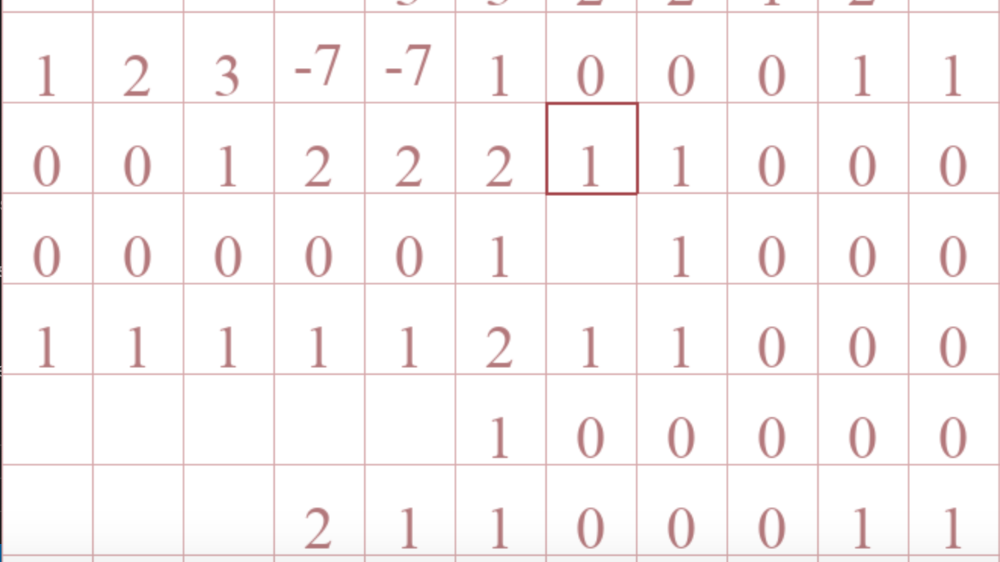

[![Contributors][contributors-shield]][contributors-url]
[![Forks][forks-shield]][forks-url]
[![Stargazers][stars-shield]][stars-url]
[![Issues][issues-shield]][issues-url]
[![MIT License][license-shield]][license-url]
[![LinkedIn][linkedin-shield]][linkedin-url]

<!-- TABLE OF CONTENTS -->
<details open="open">
  <summary>Table of Contents</summary>
  <ol>
    <li>
      <a href="#about-the-project">About The Project</a>
      <ul>
        <li><a href="#built-with">Built With</a></li>
      </ul>
    </li>
    <li>
      <a href="#getting-started">Getting Started</a>
      <ul>
        <li><a href="#prerequisites">Prerequisites</a></li>
        <li><a href="#installation">Installation</a></li>
      </ul>
    </li>
    <li><a href="#usage">Usage</a></li>
    <li><a href="#roadmap">Roadmap</a></li>
    <li><a href="#contributing">Contributing</a></li>
    <li><a href="#license">License</a></li>
    <li><a href="#contact">Contact</a></li>
  </ol>
</details>


<!-- ABOUT THE PROJECT -->
## About The Project
<p align="center">
  
</p>

Playable Minesweeper game GUI with Minesweeper board generator based on difficultly. Users can flag and reveal boxes.


### Built With
* [Python](https://www.python.org/)
* [PyGame](https://www.pygame.org/)


## Getting Started
### Prerequisites
* Python
  ```sh
  https://www.python.org/downloads/
  ```

### Installation
1. Clone the repo
   ```sh
   git clone https://github.com/rexliu3/MineSweeper.git
   ```


<!-- USAGE EXAMPLES -->
## Usage
1. (Optional) Change the colors in ```MainGUI.py```
   ```py
   backgroundColor = (ENTER DECIMAL CODE HERE)
   selectedBorderColor = (ENTER DECIMAL CODE HERE)
   sketchedNumberColor = (ENTER DECIMAL CODE HERE)
   numberColor = (ENTER DECIMAL CODE HERE)
   mainLinesColor = (ENTER DECIMAL CODE HERE)
   timeColor = (ENTER DECIMAL CODE HERE)
   wrongCounterColor = (ENTER DECIMAL CODE HERE)
   ```
2. (Optional) Change the size of board and number of mines
   ```py
   rowsNum = ENTER NUMBER OF ROWS
   columnsNum = ENTER NUMBER OF COLUMNS
   minesNum = ENTER NUMBER OF MINES
   ```
4. Run `MainGUI.py`: ```python3 MainGUI.py```
   * This will display a Minesweeper Board GUI
   * Use the mouse to click and select different boxes on the board
   * Use "return"/"enter" to reveal the selected box
   * Use "delete"/"backspace" to mark an unrevealed box as a mine
   * Use "k" to unmark an unreveal box as a mine
   * The number code:
     * 0-8: Num of Mines
     * 9: Unrevealed
     * -5: Selected
     * -1: Mine
     * -7: Marked as Mine


<!-- ROADMAP -->
## Roadmap
See the [open issues](https://github.com/rexliu3/MineSweeper/issues) for a list of proposed features (and known issues).


<!-- CONTRIBUTING -->
## Contributing
Contributions are what make the open source community such an amazing place to be learn, inspire, and create. Any contributions you make are **greatly appreciated**.

1. Fork the Project
2. Create your Feature Branch (`git checkout -b feature/AmazingFeature`)
3. Commit your Changes (`git commit -m 'Add some AmazingFeature'`)
4. Push to the Branch (`git push origin feature/AmazingFeature`)
5. Open a Pull Request


<!-- LICENSE -->
## License
Distributed under the MIT License. See `LICENSE` for more information.


<!-- CONTACT -->
## Contact
Rex Liu - rexliu3@berkeley.edu

Project Link: [https://github.com/rexliu3/MineSweeper](https://github.com/rexliu3/MineSweepe


[contributors-shield]: https://img.shields.io/github/contributors/rexliu3/MineSweeper?style=for-the-badge
[contributors-url]: https://github.com/rexliu3/MineSweeper/graphs/contributors
[forks-shield]: https://img.shields.io/github/forks/rexliu3/MineSweeper?style=for-the-badge
[forks-url]: https://github.com/rexliu3/MineSweeper/network/members
[stars-shield]: https://img.shields.io/github/stars/rexliu3/MineSweeper?style=for-the-badge
[stars-url]: https://github.com/rexliu3/MineSweeper/stargazers
[issues-shield]: https://img.shields.io/github/issues/rexliu3/MineSweeper?style=for-the-badge
[issues-url]: https://github.com/rexliu3/MineSweeper/issues
[license-shield]: https://img.shields.io/github/license/othneildrew/Best-README-Template.svg?style=for-the-badge
[license-url]: https://github.com/rexliu3/MineSweeper/blob/master/LICENSE.txt
[linkedin-shield]: https://img.shields.io/badge/-LinkedIn-black.svg?style=for-the-badge&logo=linkedin&colorB=555
[linkedin-url]: https://linkedin.com/in/rexliu3 
